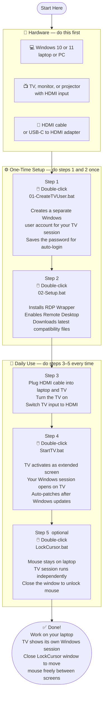

# TV Workspace

Turn your TV into an extended Windows screen in 2 clicks — with a dedicated isolated session, automatic cursor locking, and self-healing RDP setup.

> **Watch the setup walkthrough:** *(screen recording coming soon)*

---

## What This Does

- Opens a full-screen Windows session on your TV via RDP loopback
- Keeps your mouse locked to your laptop while the TV runs independently
- Automatically patches itself after Windows updates
- Uses a separate Windows user account so your TV session is clean and isolated

---

## What You Need

| Item | Details |
|---|---|
| **Windows laptop or PC** | Windows 10 or 11 (Home or Pro) |
| **TV or external screen** | Any screen with an HDMI input — TV, monitor, projector |
| **HDMI cable** | Standard HDMI — or USB-C to HDMI / DisplayPort to HDMI adapter |

> **Tip:** If your laptop only has USB-C ports, get a USB-C to HDMI adapter. Search "USB-C to HDMI adapter" on Amazon — they're under $15.

---

## Setup Flowchart

---

## File Guide

| File | When to run | What it does |
|---|---|---|
| `01-CreateTVUser.bat` | Once, first-time setup | Creates a Windows user for TV sessions. Saves credentials for auto-login. |
| `02-Setup.bat` | Once, first-time setup | Installs RDP Wrapper, enables Remote Desktop, downloads compatibility INI. |
| `CheckStatus.bat` | Any time | Shows green/red for every requirement. Diagnose problems before they become errors. |
| `StartTV.bat` | Every time you use TV | Switches to extended display, patches RDP if needed, launches TV session. |
| `LockCursor.bat` | Optional, after StartTV | Locks your mouse to the laptop. Close window to unlock. |
| `WhoReleasesClip.ps1` | Debug only | Monitors which app releases the cursor lock. Not needed for normal use. |

---

## After First-Time Setup

Your folder will contain one extra file that is **not uploaded to GitHub** (it's in `.gitignore`):

- **`tv-config.local.ps1`** — stores your TV user account name and password locally. Never share this file.

---

## How It Works (Technical)

Windows normally prevents RDP loopback connections (connecting to yourself via 127.0.0.2). **RDP Wrapper** patches `termsrv.dll` to allow this, enabling a full second Windows session to appear on the TV — with its own taskbar, apps, and desktop.

The INI file that RDP Wrapper uses to know your Windows build version updates frequently as Windows updates. `StartTV.bat` automatically checks 4 community sources and applies the latest one every time you run it, so it self-heals after Windows updates.

---

## FAQ

**Q: Do I need to be a computer expert to set this up?**
A: No. Just double-click the files in order. Each file shows clear instructions on screen.

**Q: Will this break my laptop?**
A: No. RDP Wrapper only patches one Windows service (`termsrv.dll`). Running `02-Setup.bat` or `RDPWInst.exe -u` uninstalls it completely.

**Q: Does this work on Windows Home?**
A: Yes. RDP Wrapper adds RDP support to Windows Home editions that normally block it.

**Q: My TV shows "This PC can't connect to the remote computer" — what do I do?**
A: See [TROUBLESHOOT.md](TROUBLESHOOT.md).

**Q: After a Windows Update, StartTV stopped working.**
A: Just run `StartTV.bat` again — it auto-downloads the community patch. If it says "not patched yet", wait 12–24 hours and try again. The community usually patches within a day.

**Q: Can I use a monitor instead of a TV?**
A: Yes. Any screen with an HDMI port works — TV, monitor, projector.

---

## Uninstall

To remove everything:
1. Open Command Prompt as Administrator
2. Navigate to your RDP Wrapper folder: `cd "C:\Program Files\RDP Wrapper"`
3. Run: `RDPWInst.exe -u`
4. Delete the TV Workspace folder

---

## License

MIT — free to use, modify, and share.
